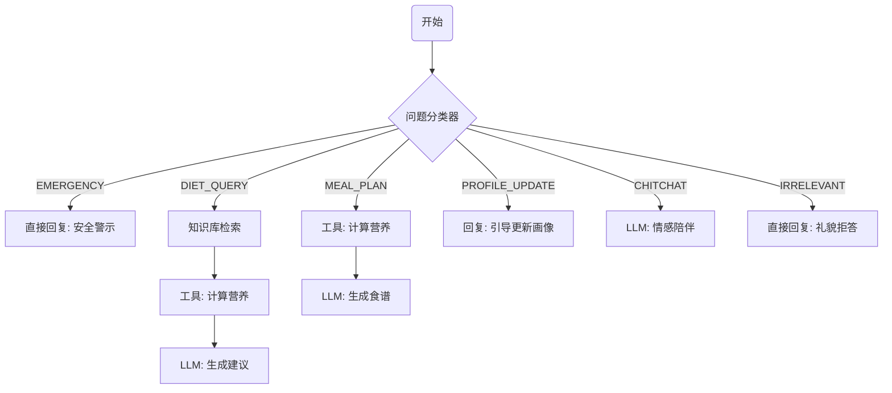

# 意图识别与路由逻辑 (Intent Classification & Routing)

在 Dify 的 Chatflow 编排中，**意图识别**是分流用户请求的关键环节。
建议使用 Dify 的 **问题分类器 (Question Classifier)** 节点，或添加一个专门的 **LLM 节点** 来进行意图判断。

## 1. 核心意图分类体系

我们将用户的输入分为以下 5 类：

| 意图代码 (Key) | 意图名称 | 典型问题示例 | 处理策略 |
| :--- | :--- | :--- | :--- |
| **EMERGENCY** | **紧急求医/安全护栏** | "胸口突然剧痛怎么办？" "我好像中风了" "吃了药有点头晕想吐" | **最高优先级**。直接输出预设的安全警示语，建议立即拨打120或就医，不进行任何营养建议。 |
| **DIET_QUERY** | **饮食咨询/宜忌** | "痛风能吃豆腐吗？" "高血压早餐吃什么好？" "糖尿病要注意什么？" | 调用 **知识库检索** + **营养计算工具**，生成个性化建议。 |
| **MEAL_PLAN** | **食谱生成/搭配** | "帮我设计明天的菜单" "晚餐吃什么？" "给我一周的高血压食谱" | 调用 **营养计算工具** (获取热量/宏量目标) -> LLM 生成具体菜单。 |
| **PROFILE_UPDATE** | **画像/信息更新** | "我最近瘦了5斤" "医生说我有糖尿病了" "我不吃香菜了" | 引导用户去“设置”页面更新画像，或在对话中确认新信息（视系统复杂度而定）。 |
| **CHITCHAT** | **闲聊/情感陪伴** | "谢谢你" "你好" "今天心情不好" | 使用 **情感陪伴 Prompt**，进行温暖的对话，不调用专业工具。 |
| **IRRELEVANT** | **无关话题/越界** | "最近哪只股票会涨？" "帮我写代码" "讲个鬼故事" "政治局势怎么看？" | **礼貌拒答**。明确告知用户本系统专注于老年营养与健康，无法回答该领域问题，并引导回营养话题。 |

## 2. Dify 问题分类器配置

在 Dify 的 **问题分类器** 节点中，请复制以下分类标准：

### Class 1: EMERGENCY
- **关键词**: 胸痛, 呼吸困难, 晕倒, 急救, 剧烈疼痛, 出血, 中毒, 救命
- **描述**: 用户表现出急性身体不适、生命危险或询问急救措施。

### Class 2: DIET_QUERY
- **关键词**: 能吃吗, 好处, 坏处, 营养, 禁忌, 功效, 怎么吃
- **描述**: 询问某种食物是否适合，或者某种疾病的饮食原则。

### Class 3: MEAL_PLAN
- **关键词**: 食谱, 菜单, 早/午/晚餐, 吃什么, 安排, 计划
- **描述**: 请求生成具体的饮食计划或菜单搭配。

### Class 4: PROFILE_UPDATE
- **关键词**: 修改, 更新, 体重, 身高, 确诊, 加上, 去掉
- **描述**: 用户想要更改自己的健康画像或偏好设置。

### Class 5: CHITCHAT
- **关键词**: 你好, 谢谢, 再见, 聊聊, 心情
- **描述**: 非功能性的日常问候或情感交流。

### Class 6: IRRELEVANT
- **关键词**: 股票, 投资, 政治, 编程, 法律, 算命, 娱乐八卦
- **描述**: 明显超出老年营养健康与日常生活照护范畴的问题。

## 3. 路由逻辑示例 (Chatflow)



## 4. 提示词示例 (LLM 节点版)

如果你不使用 Dify 内置分类器，也可以用一个 LLM 节点专门做分类：

```markdown
# Role
你是一个意图识别专家。

# Task
分析用户的输入，将其归类为以下之一：
- EMERGENCY: 涉及急症、身体不适、求救。
- DIET_QUERY: 咨询饮食建议、食物宜忌、营养知识。
- MEAL_PLAN: 请求生成食谱、菜单、饮食计划。
- PROFILE_UPDATE: 想要修改个人信息、健康状况。
- CHITCHAT: 闲聊、问候、情感交流。
- IRRELEVANT: 股票、政治、编程等与营养健康无关的话题。

# Output
仅输出分类代码 (如 "DIET_QUERY")，不要输出任何其他内容。

# User Input
{{user_input}}
```
